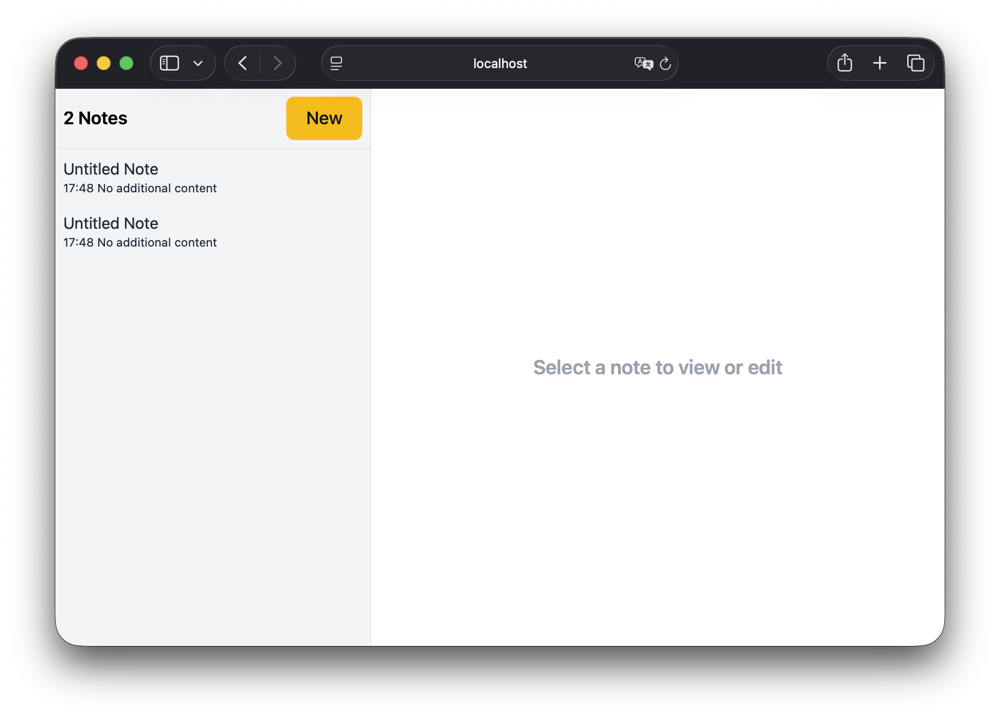

## Example Laravel Project

A simple notes application built with Laravel using the framework's default structure.

The purpose of this repository is not to build a feature-rich notes application, but to teach Laravel through a real and easy-to-follow project.

### What you will learn

- Routing.
- Controllers.
- Models.
- Database migrations.
- Views and Blade templates.
- Project organization following Laravel's conventions.

### License

This project is open-sourced software licensed under the [MIT license](https://opensource.org/licenses/MIT).